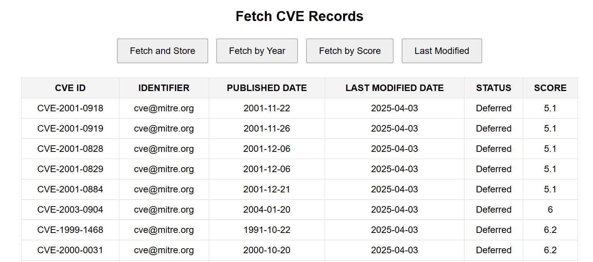

# 🚨 CVE_CUSTOM_API

A high-performance backend built with **Spring Boot**, **JPA**, and **H2** to manage and serve over **10,000+ CVE (Common Vulnerabilities and Exposures)** records.

---

### 🔧 Features
- 🔄 **Automated CVE Data Ingestion** from public sources  
- 🧠 **Custom Filtering Endpoints** by:
  - Year
  - Metric Score
  - Last Modified Date
- ⚡ **In-Memory H2 Database** for blazing-fast access
- 🏛️ Structured using **MVC Architecture** for clean separation of concerns
- 🌐 **REST APIs** with frontend-ready JSON responses

---

### 💡 Ideal for:
- Security research projects  
- Dashboard integrations  
- Learning Spring Boot + JPA + MVC  
- Rapid prototyping with CVE datasets

---
### 📸 Output Screen

  

---
Want to explore or extend CVE data capabilities? Start here.

> Built with performance, structure, and clarity in mind.
